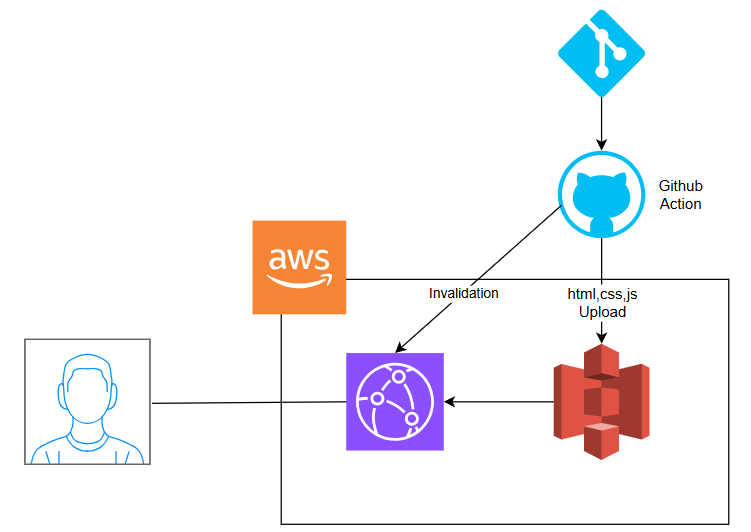
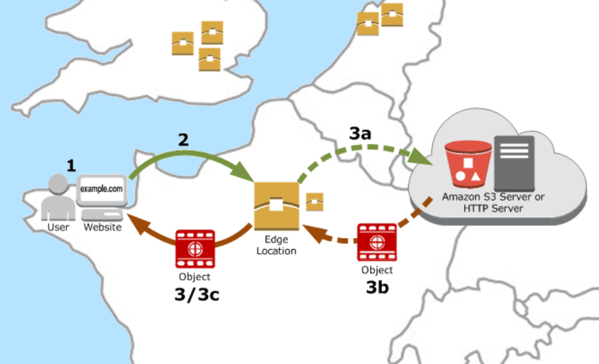

## 주요 링크

- S3 버킷 웹사이트 엔드포인트: http://hanghea-plus.s3-website.ap-northeast-2.amazonaws.com/
- CloudFrount 배포 도메인 이름: https://d25u1ylqwjv1yz.cloudfront.net

    

### 전체 flow 설명
1. next.js 프로젝트를 build 합니다.
2. build된 정적 파일들을 s3에 업로드 합니다.
3. s3의 엔드포인트로 cloudfront를 연결해 정적 파일을 제공합니다.
    - 유저는 최초에 도메인으로 접근하면 원본 s3에서 정적파일에서 콘텐츠를 가져갑니다.
    - cloudfront로 유저와 가까운 엣지 로케이션에 콘텐츠가 일정 시간 캐싱됩니다.
    - 캐싱된 시간동안 유저가 도메인으로 접근하면 cloudfront가 정적 파일을 엣지 로켄이션에서 제공하기 때문에 유저는 보다 빠른 응답을 받을 수 있습니다.
    - 캐싱시간 후에 유저가 도메인으로 접근하면 다시 콘텐츠를 s3에 있는 원본에서 가져갑니다.

        

4. IAM 설정
    - IAM을 통해 AWS 리소스에 대한 엑세스를 안전하게 제어합니다.
    - github action 등을 통해 aws 인프라를 사용하려면 (이번 프로젝트의 경우 s3와 cloudfront) 원하는 인프라에 엑세스 할 수 있는 권한을 IAM으로 설정해줘야합니다.

5. 위 1~3 과정을 github action을 통해 자동화 시킵니다.
    - main 브랜치 push를 트리거로 자동배포를 진행합니다.
    - 해당 Git 레포지토리의 의존성을 설치합니다.
    - 프로젝트를 build합니다
    - AWS 인증을 진행합니다. (필요 value: access key, scret access key, region)
    - build한파일을 aws s3에 배포합니다.
    - cloudfront의 기존 캐시를 무효화합니다. (무효화를 진행해주지 않으면 24시간 이후에 업데이트가 반영됩니다.)

